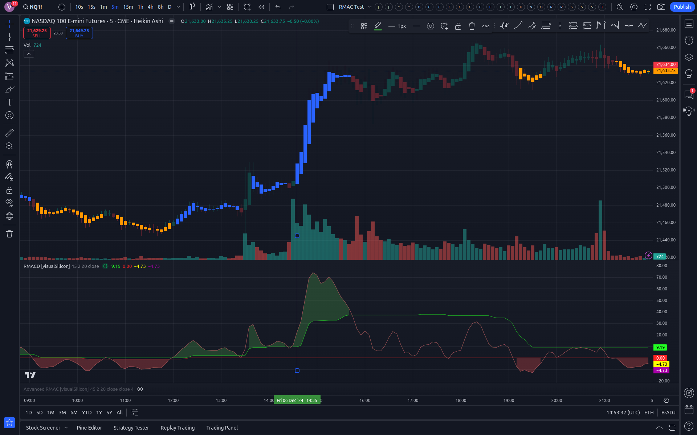

# Tradingview scripts, indicators and strategies by visualSilicon.com

These are free and open-source TradingView scripts, indicators and strategies created abnd published by visualSilicon.com

The original setups, ideas and how these were inspired are included in each case.

Please feel free to give us feedback and get in touch at by contacting info-at-visualSilicon.com

# 1: The "RMAC"

Code can be found in this repository under https://github.com/visualsilicon/tradingview/blob/main/src/indicators/rmac/RMAC.pinescript.txt

This indicator was inspired by a video published on the YouTube channel https://www.youtube.com/@chadtrades

The video explains a manual setup to make up this indicator using RSI and MACD.

Each of the two lines in the setup from the video move above or below the other line depending on the bars within your view/window.
This is not stable and can show different conflicting results.

This indicator is an ttempt to fix the problem.

Below is a screenshot of an example setup (with the bar-coloring enabled in the indicator settings):

